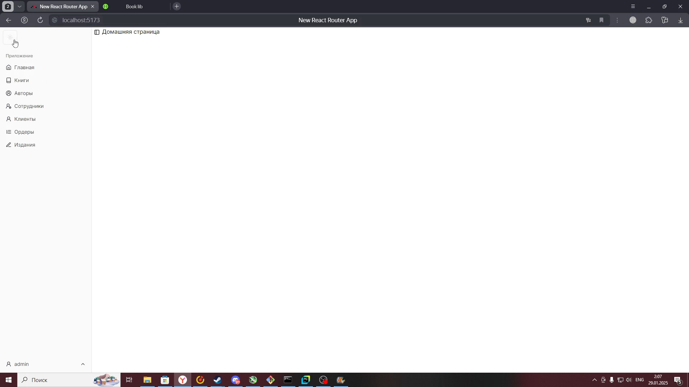
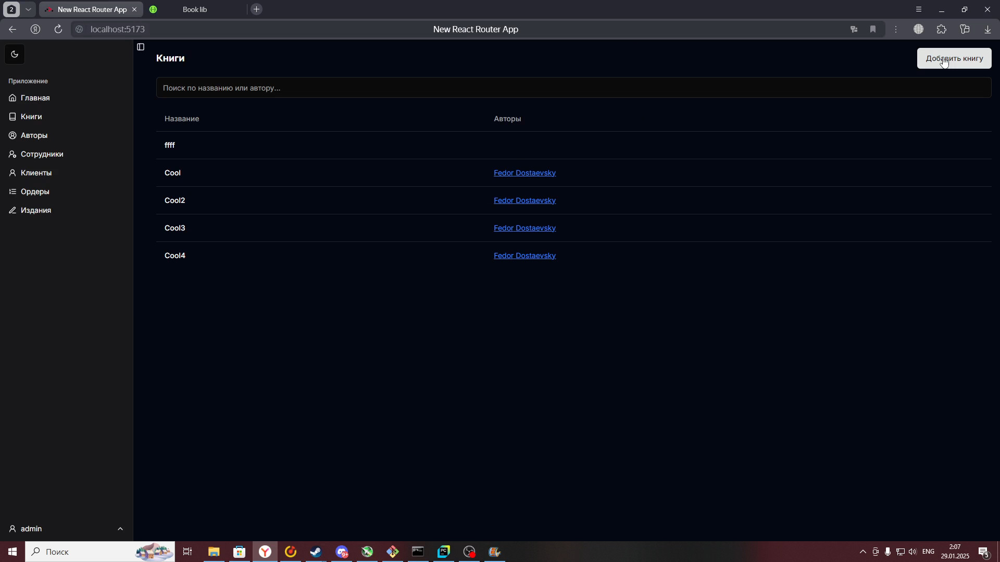
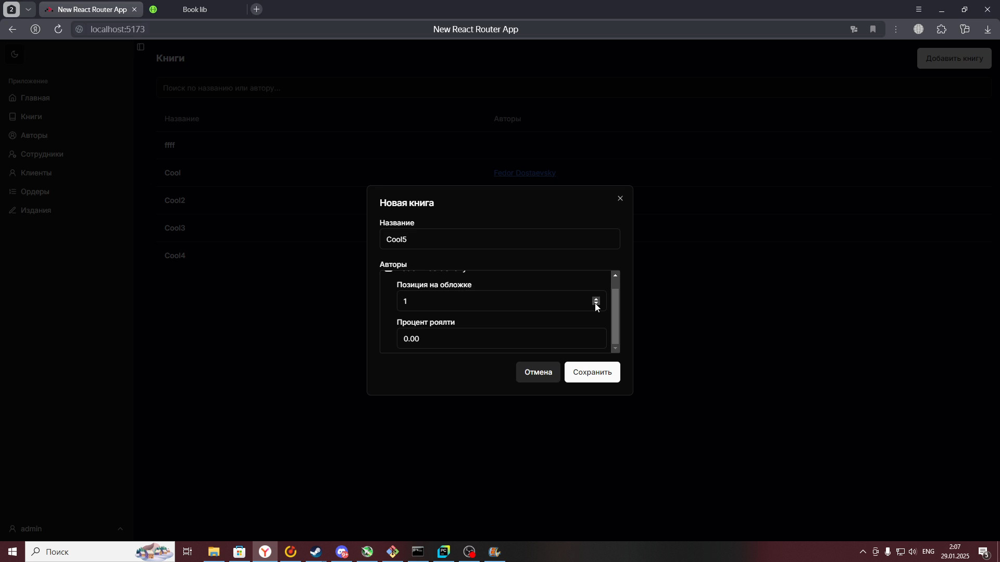
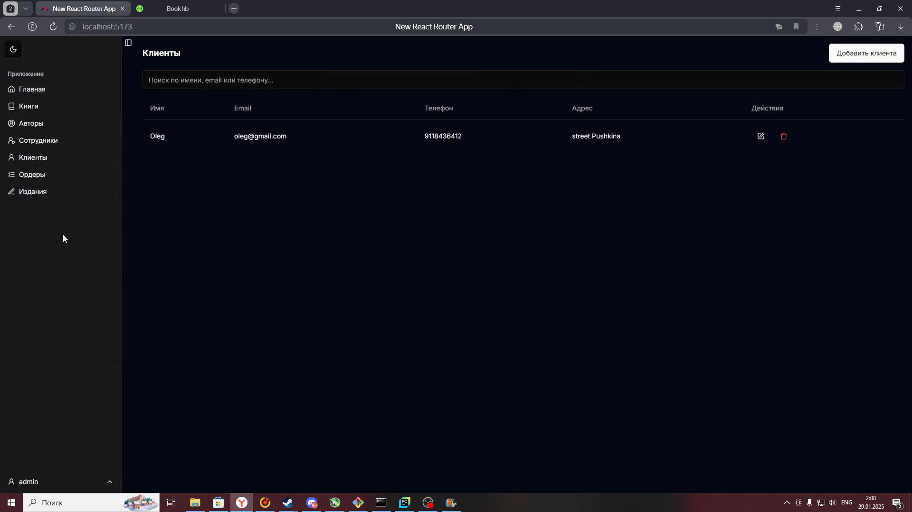
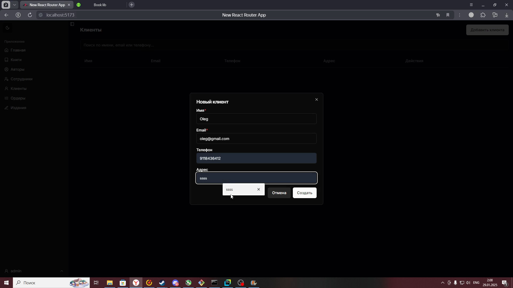
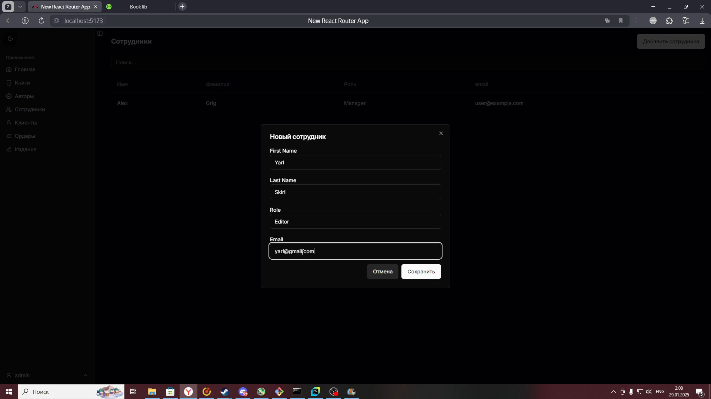
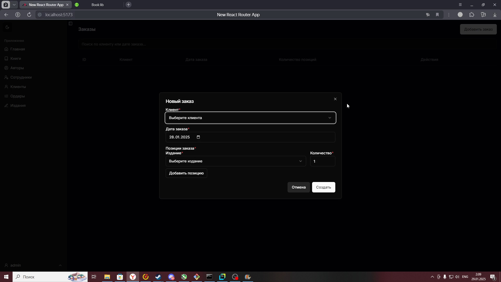

# Лабораторная работа 4

Был создан полноценный сайт для книжного магазина( реализована Backend и Frontend части).
Далее представлены вид сайта и примеры его работы.

## Страница входа

## Изменение темы

## Список книг

## Добавление книги

## Список клиентов

## Добавление клиента

## Список работников

## Добавление работника

## Создание заказа

---

[Назад к главной странице](index.md)
